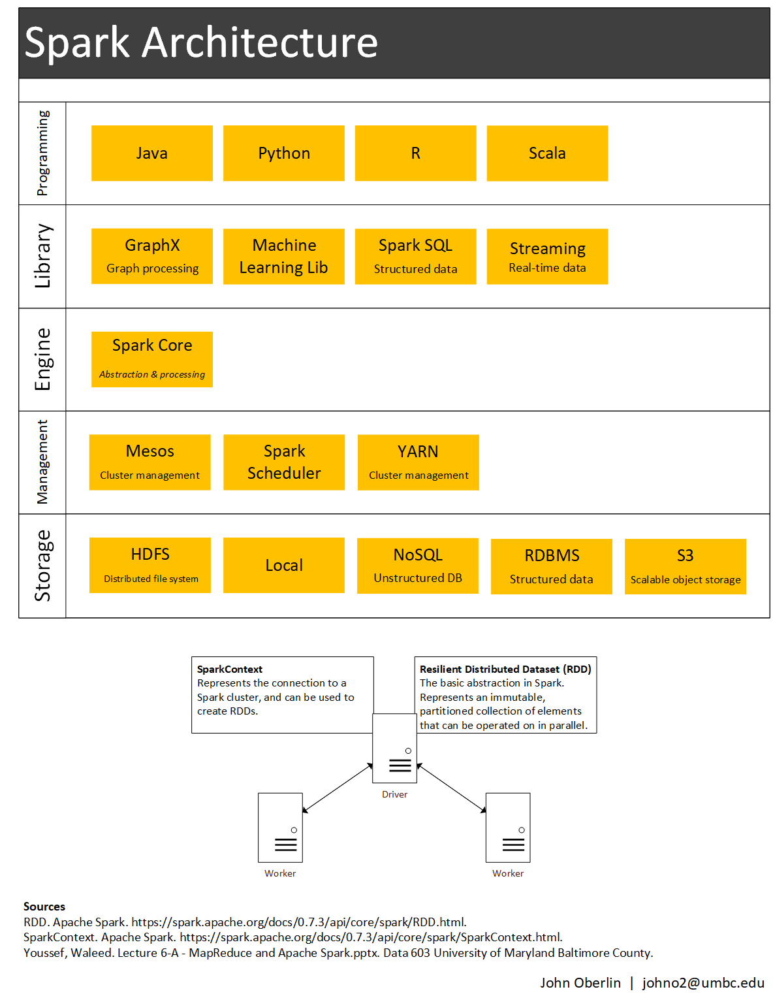

# Data 603 Homework 5
John Oberlin

## 1. Spark architecture diagram


## 2. RDDs
### Description
A Resilient Distributed Dataset (RDD) is a Spark abstraction,
the basic interface unit.
An RDD is a collection that is immutable and partitioned
and can thus can be operated on in parallel.
It is also fault tolerant.

### Creation
An RDD is created via the SparkContext
by either parallelizing another RDD in the driver program
or by accessing a dataset in an external storage.
In the former, ```sc.parallelize(data, <partitions>)```,
the collection is created as a distributed dataset for parallel processing.

The later method, ```sc.textFile('data.txt', <partitions>)```, takes a URI,
such as a local path or an HDFS path.
It can be run with wildcard on directories.
The number of partitions is optional;
Spark will default to one partition for each 128MB block.

### Processing types and examples in Python
Two types of operations are available on an RDD: transformations,
which make a new dataset, and actions, which send a result back to the driver.

#### Example 1
**Transformation**: Filter a dataset for an IP address.

**Action**: Count the number of lines that mention the IP address.

```
ip_add_RDD = input_RDD.filter(lambda x: '127.0.0.1' in x)
ip_count = ip_add_RDD.count()
```

#### Example 2
**Transformation**: Form a new RDD by passing source elements through map,
such as splitting lines into tokens.

**Action**: Return tokens to the driver with collect.

```
tokens_RDD = input_RDD.flatMap(lambda line: line.split(' '))
tokens = tokens_RDD.collect()
```

#### Example 3
**Transformation**: Form a new RDD by applying a function to each element,
such as finding IP addresses in lines of text.

**Action**: Reduce IP addresses to a list.

```
import re
ip_pattern = r'\d{1,3}\.\d{1,3}\.\d{1,3}\.\d{1,3}'
ip_RDD = input_RDD.map(lambda x: re.findall(ip_pattern, x))
ip_list = ip_RDD.reduce(lambda x0, x1: x0.extend(x1))
```

<!-- map, filter, and persist -->

### Sources
- pyspark package. Apache Spark. https://spark.apache.org/docs/2.2.1/api/python/pyspark.html
- RDD. Apache Spark. https://spark.apache.org/docs/0.7.3/api/core/spark/RDD.html.
- RDD Programming Guide. Apache Spark. https://spark.apache.org/docs/2.2.1/rdd-programming-guide.html.
- SparkContext. Apache Spark. https://spark.apache.org/docs/0.7.3/api/core/spark/SparkContext.html.
- Youssef, Waleed. Lecture 6-A - MapReduce and Apache Spark. Slides. Data 603 University of Maryland Baltimore County.

## 3. Scala, Java, and Python comparison
Java is known to be verbose and tedious. Although Scala runs within
the JVM (Java virtual machine), it is less verbose.
Python is even less verbose than Scala and
comes with a lot of out-of-the-box data science tools. However,
Scala performs faster than Python. It also compiles code before execution,
which catches errors before run. This makes changing and refactoring code
in Scala easier than in Python.
Lastly, Scala scales better than Python, which is a benefit
for deployments.

In the near future, I plan to use Python, as that is what I currently use
and am familiar with. However, from my readings, it seems Scala performs
better than Python. So, if the project requires high performance,
I'll be happy to learn Scala. If I happen to go down more of a dev ops route,
I'd possibly get into Java.

## 4. Write a Spark program
That counts the number of images in a URL [SIC web page]
and displays the URLs of these images.

<!-- REMEMBER Add screenshots of execution and results-->

```
from pyspark import SparkContext, SparkConf
import requests
import string
import re
import os
import argparse


def get_html_file(url):
    f_name = url
    for char in string.punctuation:
        f_name = f_name.replace(char,'')
    f_name += '.html'
    p = os.path.join('downloads', f_name)
    page = requests.get(url)
    page.encoding = 'utf-8' #new
    html = page.text
    with open(p, 'w') as f: f.write(html)
    return f_name


def get_img_src(url):
    '''
    Due to error work Python ver diff than driver,
    doing os.environ... as well as config sc as local
    '''
    os.environ['PYSPARK_PYTHON']='python3.5'
    os.environ['PYSPARK_DRIVER_PYTHON']='python3.5'

    conf = SparkConf().setAppName('img src scrape').setMaster('local')
    sc = SparkContext(conf=conf)

    f_name = get_html_file(url)
    p = os.path.join('downloads', f_name)
    html_lines = sc.textFile(p)

    img_lines = html_lines.filter(lambda x: ']+>'
    img_elements = img_lines.map(lambda x: re.findall(img_pat, x)[0])

    src_pat = r'src=[\'|"]([^\s]+)[\'|"]\s'
    src_attrs = img_elements.map(lambda x: re.findall(src_pat, x)[0])

    print('\nImage sources for {}'.format(url))
    for i in full_paths.collect(): print(i)

    src_attrs.saveAsTextFile('img_src_{}'.format(f_name.replace('.html',''))))


# CLI input
parser = argparse.ArgumentParser()
parser.add_argument(    '-url',
                        action='store',
                        dest='url',
                        help='Get URL\'s page\'s image sources.')

results = parser.parse_args()

if results.url != None:
    get_img_src(results.url)
```
